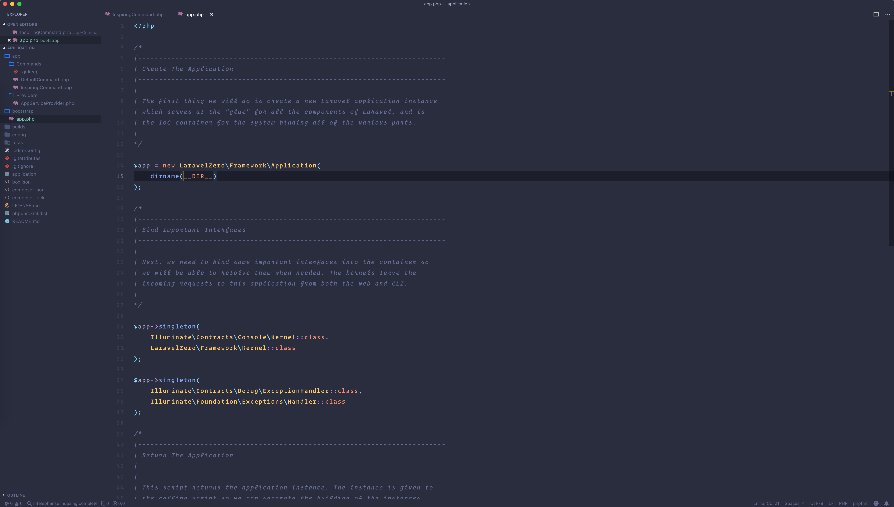

# VScode Config

`settings.json` 

```
{
    "files.autoSave": "onFocusChange",
    "workbench.colorTheme": "Material Theme Palenight",
    "editor.minimap.enabled": false,
    "editor.fontSize": 18,
    "terminal.integrated.lineHeight": 1.8,
    "terminal.integrated.fontSize": 13,
    "editor.letterSpacing": 1.7,
    "editor.lineHeight": 30,
    "files.insertFinalNewline": true,
    "php.suggest.basic": false,
    "php.validate.run": "onType",
    "editor.fontFamily": "Operator Mono, Menlo, Monaco, 'Courier New', monospace",
    "editor.fontWeight": "500",
    "workbench.activityBar.visible": false,
    "workbench.iconTheme": "eq-material-theme-icons-palenight",
    "phpfmt.enable_auto_align": true,
    "editor.formatOnSave": true,
    "phpfmt.php_bin": "/usr/bin/php",
    "workbench.startupEditor": "newUntitledFile"
}
```

## Installed Extensions

* [advanced-new-file](https://marketplace.visualstudio.com/items?itemName=patbenatar.advanced-new-file)
* [Auto Close Tag](https://marketplace.visualstudio.com/items?itemName=formulahendry.auto-close-tag)
* [Beautify](https://marketplace.visualstudio.com/items?itemName=HookyQR.beautify)
* [Bootstrap 3 Snippets](https://marketplace.visualstudio.com/items?itemName=wcwhitehead.bootstrap-3-snippets)
* [Bootstrap 4, Font awesome 4, Font Awesome 5 Free & Pro snippets](https://marketplace.visualstudio.com/items?itemName=thekalinga.bootstrap4-vscode)
* [DotENV](https://marketplace.visualstudio.com/items?itemName=mikestead.dotenv)
* [ESLint](https://marketplace.visualstudio.com/items?itemName=dbaeumer.vscode-eslint)
* [File Utils](https://marketplace.visualstudio.com/items?itemName=sleistner.vscode-fileutils)
* [Laravel 5 Snippets](https://marketplace.visualstudio.com/items?itemName=onecentlin.laravel5-snippets)
* [Laravel Blade Snippets](https://marketplace.visualstudio.com/items?itemName=onecentlin.laravel-blade)
* [Material Icon Theme](https://marketplace.visualstudio.com/items?itemName=PKief.material-icon-theme)
* [Material Theme](https://marketplace.visualstudio.com/items?itemName=Equinusocio.vsc-material-theme)
* [Path Intellisense](https://marketplace.visualstudio.com/items?itemName=christian-kohler.path-intellisense)
* [PHP Intelephense](https://marketplace.visualstudio.com/items?itemName=bmewburn.vscode-intelephense-client)
* [PHP IntelliSense](https://marketplace.visualstudio.com/items?itemName=felixfbecker.php-intellisense)
* [PHP Namespace Resolver](https://marketplace.visualstudio.com/items?itemName=MehediDracula.php-namespace-resolver)
* [phpfmt - PHP formatter](https://marketplace.visualstudio.com/items?itemName=kokororin.vscode-phpfmt)
* [Vetur](https://marketplace.visualstudio.com/items?itemName=octref.vetur)

## Screenshot




